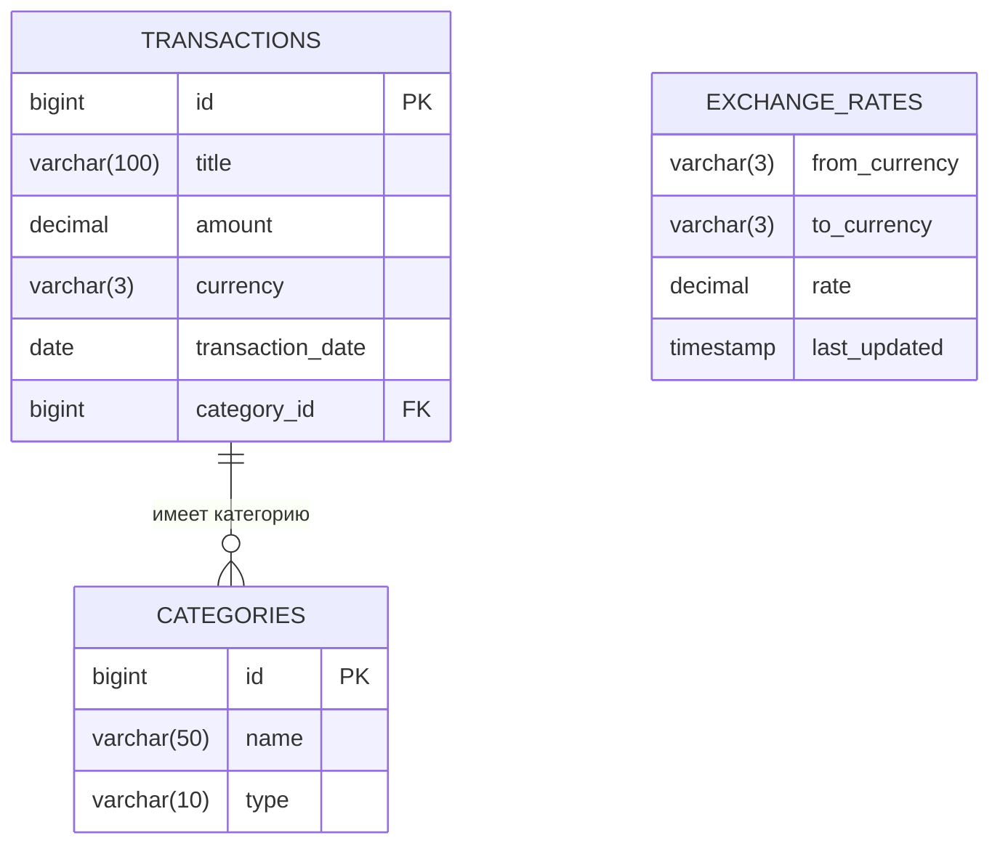

# Финансовый трекер
- **Цель:** Написать приложение на JavaFX для учёта доходов и расходов с сохранением транзакций в локальную базу данных.

- **Видение:**
  При первом запуске пользователь видит окно регистрации, где:
  — указывает имя (опционально),
  — выбирает основную валюту учёта: рубль (RUB), доллар (USD) или евро (EUR).
  После этого приложение фиксирует эту валюту как основную — все суммы отображаются и сохраняются в ней.
  В любой момент пользователь может сменить валюту в настройках, но сами транзакции хранятся в той валюте, в которой были введены. Пересчёт баланса — динамический, на основе актуальных курсов.

- **Особенности:**
    - Полностью локальное хранение данных (H2).
    - Поддержка нескольких валют в транзакциях, но единая валюта отображения (выбирается при регистрации).
    - Курсы валют подтягиваются из публичного API (exchangerate.host) при наличии интернета и кэшируются.
    - Работа без интернета: используются последние известные курсы.
    - Финансовые данные никогда не отправляются в сеть — только запрос курса.
    - Логируем:
      — действия пользователей (регистрация, добавление/удаление транзакций, экспорт/импорт, смена валюты) — в консоль;
      — исключительные ситуации (ошибки БД, сетевые сбои, повреждение данных) — в файл `logs/app.log`.
    - Для логирования используем библиотеки SLF4J с реализацией Logback.

- **Задачи:**
1. Обсудить все нюансы создания приложения.
2. Познакомиться с инструментами (JavaFX, H2, JDBC, Scene Builder).
3. Создать репозиторий, подключить участников, оформить базово.
4. Разрабатывать в локальных ветках.
5. Проводить совместное тестирование на ключевых этапах.
6. При необходимости — рефакторинг.
7. Финальное тестирование, правки, защита.

---  
## Таблица ролей и обязанностей

| Роль                | Обязанности                              | Исполнитель    |  
|---------------------|------------------------------------------|----------------|  
| Архитектор данных   | Работа с данными и бизнес-логикой        | Вилл Максим    |  
| Фронт-разработчик   | Визуальная часть приложения (UI/UX)      | Абрамов Илья   |  
| Менеджер интегратор | Связка между фронтендом и логикой        | Беседин Кирилл |  

---  
## Подробное описание ролей
### **Архитектор данных**
- Проектирование схемы БД и сущности `Transaction` (`id`, `title`, `category`, `amount`, `currency`, `date`).
- Написание SQL-скриптов, настройка подключения к H2 через JDBC.
- Реализация сервисов: добавление, удаление, история, расчёт баланса и сумм за период.
- Поддержка мультивалютности: хранение валюты транзакции, динамический пересчёт баланса в основную валюту.
- Проектирование формата резервных копий (JSON/CSV).
- Хранение основной валюты пользователя и кэшированных курсов (в H2 или JSON-файле).

### **Менеджер интегратор**
- Создание контроллеров для экрана регистрации и основного интерфейса.
- Валидация ввода (сумма > 0, дата не в будущем и т.п.).
- Интеграция API курсов валют:
  — запрос при первом запуске и по кнопке «Обновить»,
  — кэширование курсов,
  — fallback на кэш при отсутствии сети.
- Обеспечение: финансовые данные не уходят в сеть — только запрос курса.

### **Фронт-разработчик**
- Создание FXML-макетов: экран регистрации и основное окно.
- Визуализация: панель баланса, форма ввода транзакции, таблица истории.
- Стилизация через CSS.
- Компоненты: `TextField`, `DatePicker`, `ComboBox` (для категории и валюты), кнопки.
- UI для настроек: выбор основной валюты с возможностью смены.

---  
## Этапы разработки
### Глобальный этап
1. Создать проект (Maven/Gradle).
2. Добавить зависимости: JavaFX, H2, JDBC, SLF4J, Logback.
3. Настроить структуру папок.

### Локальные этапы
1. **Архитектор данных** — сущности, БД, сервисы, логика валют, экспорт/импорт.
2. **Менеджер интегратор** — контроллеры регистрации и основного экрана, валидация, обработка смены валюты, `ExchangeRateService`.
3. **Фронт-разработчик** — FXML, CSS, привязка к контроллерам.
4. **Совместная интеграция** — проверка:
    - при первом запуске — регистрация и выбор валюты,
    - все операции — в выбранной валюте,
    - баланс пересчитывается динамически,
    - курсы обновляются при запросе, работают в offline.

---  
## ER-диаграмма

