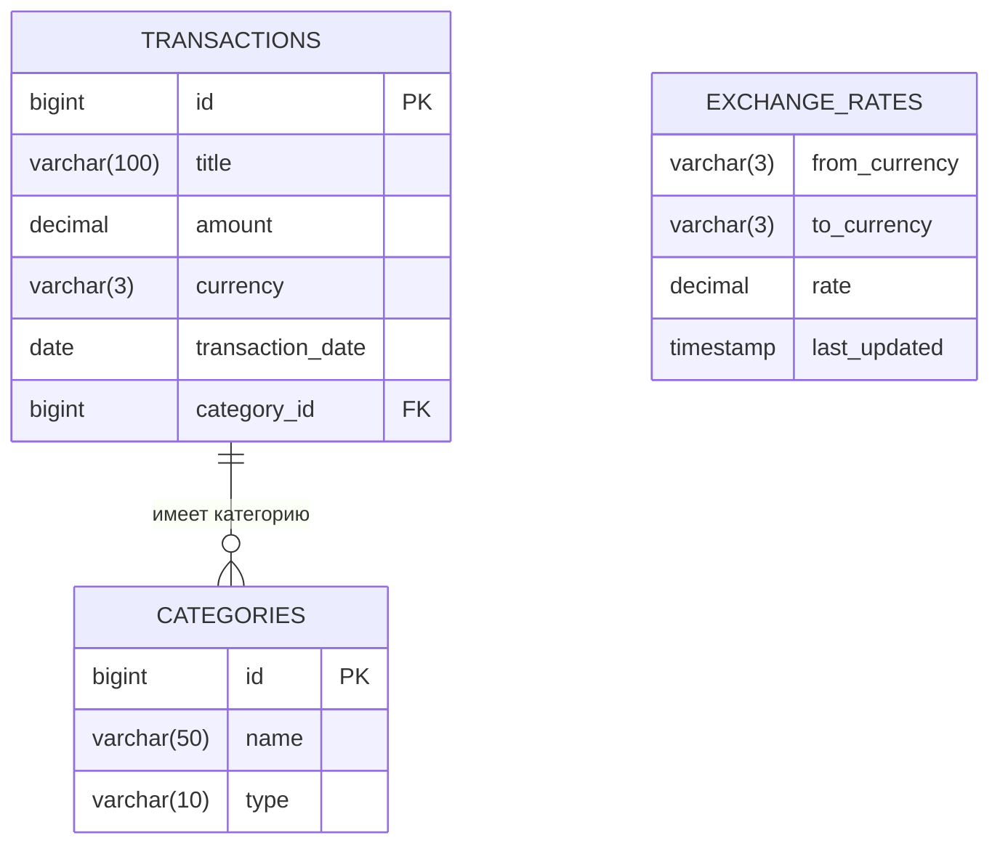

# FinanceTracker – Приватный финансовый журнал  
*Контролируй доходы, расходы и баланс — без облаков, без трекинга, без компромиссов.*

---

## О проекте  
**Цель:** Десктопное JavaFX-приложение для учёта личных финансов с поддержкой нескольких валют и автономной работы.  

> **Important**  
> **Все финансовые данные хранятся локально. Никогда не отправляются в сеть.**  
> Интернет используется **только** для запроса курсов валют — и то по желанию.

---

## Участники команды  

| Участник                                             | Роль                | Обязанности                         |
| ---------------------------------------------------- | ------------------- | ----------------------------------- |
| [Вилл Максим](https://github.com/MaximVill)          | Архитектор данных   | Бизнес-логика, БД, мультивалютность |
| [Абрамов Илья](https://github.com/abramov222)        | Фронт-разработчик   | UI/UX, JavaFX, стилизация           |
| [Беседин Кирилл](https://github.com/Sognatore-coder) | Менеджер интегратор | Контроллеры, API, валидация         |

---

## Видение проекта  

### Основной сценарий использования  
- При первом запуске:  
	- Указание имени (опционально)  
	- Выбор основной валюты (RUB / USD / EUR) — **фиксация для всего интерфейса**  
- В работе:  
	- Добавление транзакции в любой валюте  
	- Баланс **динамически пересчитывается** в основную валюту  
	- Курсы обновляются вручную или при старте (если есть интернет)  
	- Экспорт/импорт данных в JSON или CSV  
	- Смена основной валюты **без потери истории**

> **Tip**  
> Транзакции **хранятся в оригинальной валюте**, но отображаются в выбранной — с пересчётом по актуальному курсу.

---

## Особенности  

| Особенность            | Описание                                                 |
| ---------------------- | -------------------------------------------------------- |
| **Локальное хранение** | БД H2 — всё на устройстве                                |
| **API курсов**         | `exchangerate.host` — без ключа, без регистрации         |
| **Офлайн-режим**       | Используются закэшированные курсы                        |
| **Приватность**        | Финансы **никогда не покидают ПК** — только запрос курса |
| **Логирование**        | SLF4J + Logback                                          |

---

## Логирование  

- **Действия пользователя** (регистрация, транзакции, экспорт, смена валюты) → **в консоль**  
- **Ошибки** (БД, сеть, повреждение данных) → **в файл `logs/app.log`**

---

## Структура базы данных  

### ER-диаграмма

### Ключевые таблицы

- `TRANSACTIONS` — все операции
- `CATEGORIES` — категории (доход/расход + название)
- `EXCHANGE_RATES` — кэш курсов валют
- `USER_SETTINGS` — основная валюта, имя

---

## Этапы разработки

### Неделя 1: Основа

- Настройка Maven-проекта
- Подключение JavaFX, H2, SLF4J, Logback
- Проектирование БД и сущностей
- Экран регистрации + выбор валюты

### Неделя 2: Ядро функционала

- Добавление/удаление транзакций
- Динамический пересчёт баланса
- Интеграция `exchangerate.host`
- Кэширование курсов
- Экспорт/импорт (JSON/CSV)

### Неделя 3: Интеграция и polish

- Связка UI ↔ контроллеры ↔ логика
- Валидация ввода (сумма > 0, дата ≤ сегодня)
- Тестирование онлайн/оффлайн сценариев
- Стилизация интерфейса (CSS)
- Финальное тестирование

---

## Технологический стек

### Основные технологии

- **Java 21 + JavaFX** — UI
- **H2 Database** — локальное хранение
- **Maven** — сборка

### Зависимости

- **SLF4J + Logback** — логирование
- **Gson** — сериализация JSON
- **Apache HttpClient** — запросы к API

---

## Функциональные требования

- Регистрация с выбором валюты
- Учёт транзакций в любой валюте
- Динамический баланс в основной валюте
- Офлайн-режим с кэшированными курсами
- Экспорт/импорт (JSON, CSV)
- Логирование действий и ошибок
- Локальное хранение — без отправки данных
