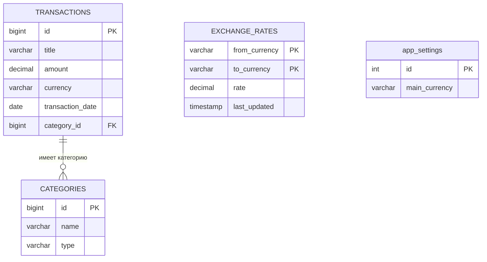

# FinanceTracker – Приватный финансовый журнал  
*Контролируй доходы, расходы и баланс — без облаков, без трекинга, без компромиссов.*

---

## О проекте  
**Цель:** Десктопное JavaFX-приложение для учёта личных финансов с поддержкой нескольких валют и автономной работы.  

> **Important**  
> **Все финансовые данные хранятся локально. Никогда не отправляются в сеть.**  
> Интернет используется **только** для запроса курсов валют — и то по желанию.

---

## Участники команды  

| Участник                                             | Роль                | Обязанности                         |
| ---------------------------------------------------- | ------------------- | ----------------------------------- |
| [Вилл Максим](https://github.com/MaximVill)          | Архитектор данных   | Бизнес-логика, БД, мультивалютность |
| [Абрамов Илья](https://github.com/abramov222)        | Фронт-разработчик   | UI/UX, JavaFX, стилизация           |
| [Беседин Кирилл](https://github.com/Sognatore-coder) | Менеджер интегратор | Контроллеры, API, валидация         |

---

## Видение проекта  

### Основной сценарий использования  
- При первом запуске:  
  - Указание имени (опционально)  
  - Выбор основной валюты (`RUB` / `USD` / `EUR`) — фиксируется для всего интерфейса  
- В работе:  
  - Добавление транзакции через интуитивные кнопки **«Заработал»** и **«Потратил»**  
  - Выбор категории (доход/расход) для точной классификации  
  - Баланс и статистика **автоматически пересчитываются** в основную валюту  
  - Поддержка **офлайн-режима**: используются актуальные курсы (до 24 часов)  
  - Полное управление данными: **редактирование и удаление** транзакций прямо из истории  
  - Гибкость: смена основной валюты в любой момент без перезапуска

> **Tip**  
> Транзакции **хранятся в оригинальной валюте**, но отображаются и суммируются в выбранной — с пересчётом по курсу ЦБ РФ.

---

## Особенности  

| Особенность            | Описание                                                 |
| ---------------------- | -------------------------------------------------------- |
| **Локальное хранение** | БД H2 — всё на устройстве                                |
| **API курсов**         | Официальный API Центрального банка РФ                    |
| **Офлайн-режим**       | Курсы кэшируются на 24 часа                              |
| **Приватность**        | Финансы **никогда не покидают ПК** — только запрос курса |
| **Логирование**        | SLF4J + Logback → консоль и файл `logs/app.log`          |
| **Однократная настройка** | Окно регистрации показывается только при первом запуске |

---

## Логирование  

- **Действия пользователя** (настройка, транзакции, категории) → **в консоль**  
- **Ошибки** (БД, сеть, валидация) → **в файл `logs/app.log`**

---

## Структура базы данных  

### ER-диаграмма

### Ключевые таблицы

- `TRANSACTIONS` — все операции  
- `CATEGORIES` — категории с типом (`income` / `expense`)  
- `EXCHANGE_RATES` — закэшированные курсы валют (все пары проходят через RUB)  
- `app_settings` — настройки приложения (`id = 1`, `main_currency`)

> Имя пользователя не хранится в БД — оно используется только для логирования и UX.

---

## Технологический стек

### Основные технологии
- **Java 21 + JavaFX** — UI и бизнес-логика  
- **H2 Database** — локальное хранение данных  
- **Maven** — управление зависимостями  

### Зависимости
- **SLF4J + Logback** — логирование  
- **Jackson Databind** — парсинг JSON от API ЦБ  
- **java.net.http** — HTTP-клиент

---

## Функциональные возможности

- Однократная настройка профиля при первом запуске  
- Учёт доходов и расходов в любой валюте  
- Автоматический пересчёт баланса в выбранной основной валюте  
- Интуитивный ввод через кнопки **«Заработал» / «Потратил»**  
- Полное редактирование и удаление транзакций  
- Управление категориями (добавление, удаление)  
- Обновление курсов вручную или автоматически  
- Смена основной валюты без перезапуска  
- Офлайн-режим с актуальными курсами  
- Приватность: данные никогда не покидают устройство
